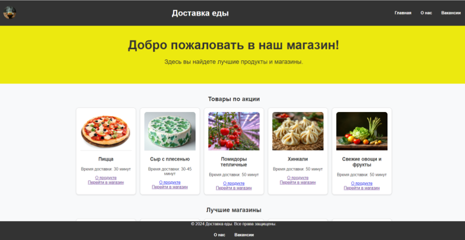

# Search-Food
Это веб-приложение на базе Flask для управления продуктовым магазином. Приложение включает в себя функциональные возможности для просмотра магазинов, продуктов питания, покупки продуктов питания и управления заявками на работу.  

  

# Особенности

Просмотрите список магазинов и продуктов питания. 

Просмотрите подробную информацию о конкретном магазине или продукте питания. 

Покупайте продукты питания со стоимостью доставки. 

Просмотрите страницу "О компании", вакансии и подайте заявку на работу. 

Отправьте резюме через форму. 

# Лицензия

Этот проект лицензирован по лицензии MIT. Подробности смотрите в файле ЛИЦЕНЗИИ.

# Контакт

По любым вопросам или предложениям, пожалуйста, открывайте проблему или обращайтесь к сопровождающим.
